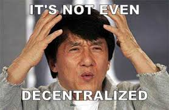

# 🫂 What we decentralized

<figure><figcaption>
<strong>Note</strong>: Distributed computing is NOT decentralized computing! Distributed nodes can still be owned by one entity!
</figcaption></figure>

**Note**: The **above diagram** is a <mark style="color:red;">**HORRIBLE & INACCURATE**</mark> representation of what decentralization might mean. Decentralization at its core means: "No single user can alter the state of data, even their own, in a networked environment".  Clearly, this is not depicted in this diagram. Other attributes, like permission-less-ness, autonomous, etc... are also not attributes of decentralization. They are their own characteristics but are often conflated with the theme of decentralization.

## Two Q's keep coming up

<mark style="color:blue;">**"This doesn't seem like it has or needs to have any decentralized elements. What's decentralized?"**</mark>&#x20;

The answer to the 1st Q usually prompts the 2nd Q.

<mark style="color:blue;">**"Why do you need to decentralize these elements?"**</mark>

### We get it... 🤔

Biologically, we're wired to spend the least amount of energy and go just deep enough to understand the problem's symptoms and propose solutions. Peeling back enough layers costs more energy and we almost all have "better" things to do for ourselves.&#x20;

But spend enough time and you'll recognize why decentralization is a necessary core functionality.

If you've already read[#a-marketplace-owned-and-governed-by-its-users](../deeper-dive/the-solution-construct.md#a-marketplace-owned-and-governed-by-its-users "mention"), you got some some detail. In addition, [#on-chain-reputation-and-the-dema-platform](../deeper-dive/the-solution-construct.md#on-chain-reputation-and-the-dema-platform "mention") teased why we need to decentralize. So here we'll expand! 👣 After all, that's why you're in this section.

## Should everything around us be decentralized?

What function should be decentralized depends on what you want to limit, not necessarily what you want to allow! Let's take **Social Networks** as an example.

If preventing _<mark style="color:blue;">censorship & maintaining free speech</mark>_ is the goal --> <mark style="color:blue;">Decentralize controls for censorship</mark> (political & administrative decentralization). You reduce, and this the operative word -- "reduce", control by any one party.

But if the goal of a social network is to monetize content & scale attracting attention, decentralization won't solve problems that come with this as it's a "do not limit" maximization function... "Do not limit" for **each** person is a feature that creates an incentive for **every** person on that social platform to make more, so there's no programmatic systematic incentive for them to reign themselves in.&#x20;

**To summarize**: Minimization goals point the way to functions you should decentralize; maximization goals make it clear that decentralization won't help!

### The interplay: Human behavior & decentralization

It is a prevalent human trait to excel (some may call it "abuse") at personal incentives and reward functions. In and of itself, decentralization incentives don't prevent nor cure the desire by humans to excel or abuse.&#x20;

For most humans anyway, the excel/abuse function is unintentional at first! Most simply get hijacked by physical incentives (e.g.: sugar, convenience shopping, free returns, vanity of being celebrated and getting attention?!?!). Humans have a hard time getting off such incentives, especially if the short term incentive mimics the frog's short-sightedness in the "boiling frog" syndrome (i.e.: you take a short term view vs a long term view).

## **What principle will Dema use to deploy Decentralization then?**

Decentralized smart contracts are like stepping stones. If created & aligned to well-devised incentives & the user experience is easy to follow, it will create limit functions that deliver instant-use tools to help each user **self-regulate**. Like rehabilitation therapy at first, once someone has achieved self-regulation, it helps prevent anyone from getting off that path. Basically, making it easier to practice self-limitation.

We designed Dema to help make that happen by ensuring the user experience is easy to partake in.

&#x20;[Hover over here for another mind expanding thought related to this idea](#user-content-fn-1)[^1]! And much like the speed of light being a specific value, Dema's decentralization ethos is driven to use dynamically stable analogs in making initial decision about how to build Dema and what governance means.

## What functions are decentralized in Dema?

Dema implements **administrative, political, fiscal & market decentralization functions.** What this means is that governance, ownership, infrastructure, payments, sign-ups, reputation, permission to join/leave, dispute resolution & every process that touches a shared resource needs to be decentralized sufficiently. The goal is to reduce control by any one party and prevent any one group, no matter how quickly they collude, from being able to marshal Dema's resources for their benefit exclusive of the others.&#x20;

To that end, we have conceived of a "built-in" _**decentralized reset switch**_! More on that later.

<figure><figcaption></figcaption></figure>

## Eliminating centralized interfaces to Dema

Creating a marketplace owned & governed by its sellers and shoppers means no single feature can be empowered or managed by a _centralized_ infrastructure or element. Why?

Because <mark style="color:blue;">**any portion of the Dema protocol that is centralized makes it susceptible to an exploit**</mark>. After all a centralized authority can exert its control to maximize/minimize the performance of that function [(want more details?)](#user-content-fn-2)[^2].&#x20;

Even then, Dema will still rely on an internet that, until the foreseeable future anyway, remains under the control of centralized entities (think Telcos & related invested adjacent ecosystems).&#x20;

Still, even for a centralized environment, the internet's operators would have a hard time exercising precise control over every decentralized infrastructure node; for it comes with its own social repercussions. So for now, we'll assume that is a problem we don't have to worry about at Dema; for the foreseeable future anyway!

<figure><figcaption>
If decentralized runs over centralized, can it stay decentralized? You tell us!
</figcaption></figure>

Alright, so "why decentralize these functions?"

1. **Governance**: When shoppers or sellers want to submit a ballot for consideration to be voted on, you want the identity, anonymity and verifiability of the results to be provable to everyone. You don't want a "trust us" (in the hands of an operator central "authority") response, especially on thorny polarizing issues.
2. **Shares with Utility**: A shopper's or seller's voting power is commensurate to how much they have used the system. To keep track, Dema needs to quantify the value of usage and count it anonymously. However, shares have other uses as well including the below list, none of which are possible at the lowest cost, fastest speed with those elements not being decentralized:
   * **Shoppers stake their shares to vet a new seller/store/product**: Basically, a shopper is staking their own value of shares to help a new product/seller appear in the search results for Dema when that party does not have shares to use for that purpose. Recall, nearly all seller and shopper ownership shares are given out for free just for creating, supporting and mostly for using the network!
   * **Shoppers can lend their shares for a return**: Out to others who can place ads in the network (it's a parabolic function so gets expensive the more ads one party uses). There should be a marketplace for those shares to be lent and again, it needs to be decentralized to avoid exploitation, including making the algorithm for how those shares can be used for ads to minimize creating an advantage for a specific group.
   * **Shares have commercial sellable value**: The Dema network itself has a valuation. The shares represent that value so shares can be sold to reap the benefit of that value (this is the cost of the customer acquisition delayed, instead of borne upfront). You want to be able to manage those shares in a decentralized environment to reduce the cost and compliance overhead of being able to move them around to near zero. No middle-persons.
   * **Sellers can stake their shares for loans**: In the real world, a seller would require weeks to get a loan collateralized against their business and the cost would not be insubstantial. In the DeFi world, it takes seconds at near zero cost. Still, a seller wants a simple user experience. So Dema allows sellers to stake their shares and **just by pushing one on-screen button** & get a loan in less <1min.
3. **Building an Autonomous Protocol**: An autonomous protocol is one which runs itself. Of course, if it runs itself, you don't want it to run on a centralized infrastructure like AWS. Instead, we'll run it on a decentralized infrastructure, including contracts on Solidity (e.g.: on Polygon (MATIC)), or as an example, the use of Akash (AKT) for compute infrastructure and IPFS (for user's data). One of Dema's protocol goals is to ensure its users own their own data & can use it however they choose.

### **Benefit Unlocked - Permissionlessness 🔓**

One of the main benefits of doing this on a decentralized infrastructure is that any shopper or seller can now join as long as they meet the requirements as set out in a smart contract. We call this benefit: Permission-less-ness. You simply don't need any human's permission (along with the risk of potential biases).&#x20;

## So what is decentralized at Dema?

* **The Protocol**: The set of smart contracts on which the entire marketplace runs including the orders, returns, customer support, policies, etc... All set by contract with user data stored in IPFS files running on decentralized infrastructure for compute (users searching, listing, updating CDNs, etc...).&#x20;
* **Seller's and Shopper's Reputation**: This is a quantified equation (think of the analog of a credit score) based on the set of reviews, metrics and actions you take (e.g.: a shopper returns too much, so they're scored negatively on their reputation, based on verifiable data that they own of their own actions, e.g.: orders and returns). Reputation is a critical element of the decentralized "limit" functions for a marketplace to run effectively. More on that later...
* **Shopper's and Seller's Data**: Dema should never build solutions that trap a shopper or seller in the network. This is another problem we don't dive into too much detail about in this introduction. What we want to highlight is that It should be their data so they can switch away (near zero cost switching) at any time to any marketplace they want and not have to start with zero reputation. By contrast, Amazon locks away the reputations of sellers so if they want to start at Walmart, they can't simply take the cache of scores and reviews they've amassed and prove that they're the same seller elsewhere. And there is no shopper reputation provided to sellers, so there's no feedback loop and toolset for them to adjust on how to deal with good or bad actors.

The above is a brief introduction to "Why" and "What" is decentralized. We'd love to hear from you so please reach out to discuss this in greater detail.

[^1]: Ever consider why the speed of light is 299,792 km/s? Why not more OR less? Why that number specifically? Well, cosmological physicists have a reasonable hypothesis suggesting it if were higher, the Universe's expansion may become a runaway process; lower, and the Universe is likely to collapse or be absent many features; the value is a stability feature; "Who designed it?", "If they exist?", "How?" or "For what purpose?" is not the point here. \
    \
    The point is that there's a natural limit to every feature in a system. Once you exceed those limit or reduce it too much, you start to break the system; marketplaces included:bangbang:

[^2]: This is a long discussion. Hit us up for an in-depth dissertation!
